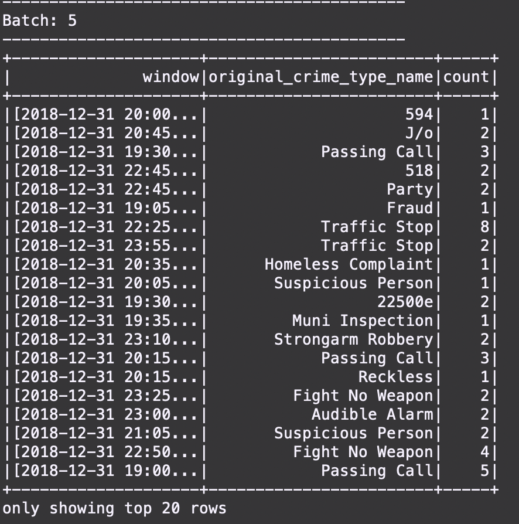
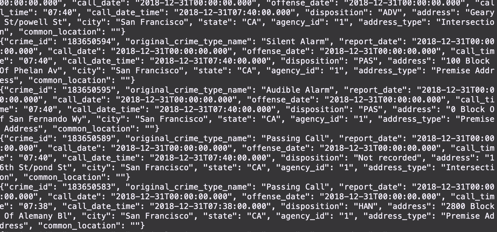

# SF-Crime-Statistics-with-Spark-Streaming
## Data Streaming Using Spark

### Objective
In this project, you will create a kafka server that loads a local file and streams out a json object to Spark Structured Streaming. At the completion of the project, you will be able to show statistical values in configured windows.



Prerequisites:
- Spark 2.4.3
- Scala 2.11.x
- Java 1.8.x
- Kafka build with Scala 2.11.x
- Python 3.6.x or 3.7.x

Environment Setting:
- Download Spark from https://spark.apache.org/downloads.html. Choose `Prebuilt for Apache Hadoop 2.7 and later`
- Unpack Spark in one of your folders (I usually put all my dev requirements in `/home/users/user/dev`)
- Download Scala from the official site or for Mac users, you can also use `brew install scala` but make sure you download version `2.11.x`
- Run below to verify correct versions
```
java -version
scala -version
```
- Make sure your `~/.bash_profile` looks like below (might be different based on your directory)
```
export SPARK_HOME=/Users/dev/spark-2.3.0-bin-hadoop2.7
export JAVA_HOME=/Library/Java/JavaVirtualMachines/jdk1.8.0_181.jdk/Contents/Home
export SCALA_HOME=/usr/local/scala/
export PATH=$JAVA_HOME/bin:$SPARK_HOME/bin:$SCALA_HOME/bin:$PATH
```

### Implementing the project

### To Start the Project
This project requires creating topics, starting zookeeper and kafka server, and your kafka bootstrap server.
Use commands below to start zookeeper and kafka server.

```
bin/zookeeper-server-start.sh config/zookeeper.properties
bin/kafka-server-start.sh config/server.properties
```
You can start the server using python command:
```angular2html
python producer_server.py
```

### Step 1
The first step is to build a simple Kafka server. Complete the server in `data_producer/producer_server.py`
To see if you correctly implemented the server, use command `bin/kafka-console-consumer.sh --bootstrap-server localhost:9092 --topic <your-topic-name> --from-beginning` to see your output.



### Step 2
Apache Spark already has an integration with Kafka Brokers, hence we will not need a separate Kafka Consumer.
Implement features in `streaming/data_stream.py`
Do a `spark-submit` using this command:
```
spark-submit --packages org.apache.spark:spark-sql-kafka-0-10_2.11:2.3.0 --master local[4] data_stream.py
```
